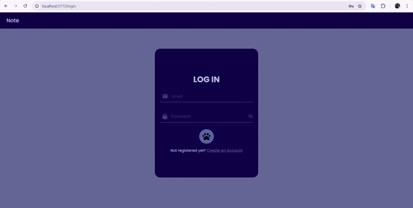
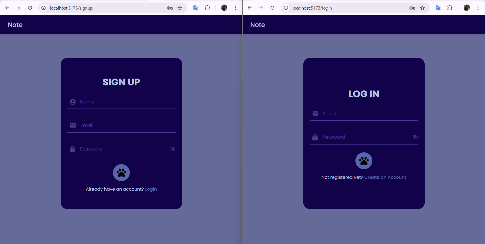
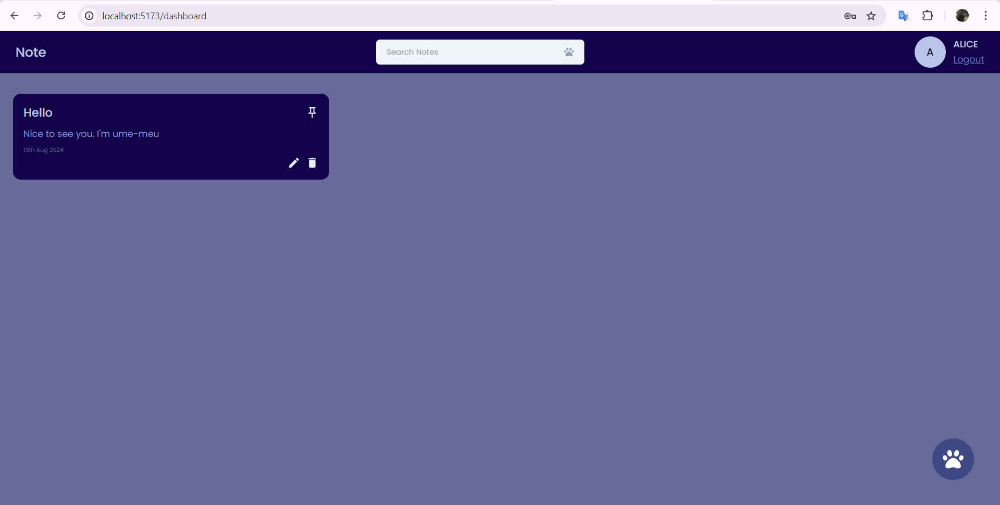

# 📝 Note App

**Note** is a powerful note-taking application designed to keep your thoughts organized and accessible. With robust user authentication and secure storage, you can create, manage, and search through your notes with ease.

## 📖 Table of Contents
- [Project Overview](#project-overview)
- [Features](#features)
- [Getting Started](#getting-started)
  - [Project Structure](#project-structure)
  - [Installation](#installation)
  - [Running the Application](#running-the-application)
- [App Functionality](#app-functionality)
  - [User Authentication](#user-authentication)
  - [Notes Management](#notes-management)
  - [Search and Tagging](#search-and-tagging)
- [Customizations and Enhancements](#customizations)
- [Demo](#demo)
- [Screenshots](#screenshots)
- [Reference](#reference)
- [Contributing](#contributing)
- [License](#license)
- [Contact](#contact)

<h2 id="project-overview">📋 Project Overview</h2>

**Note** is a full-stack application that enables users to take and manage notes securely. The app features user authentication, real-time CRUD operations, and a clean, user-friendly interface built with React. The backend is powered by Express.js and Node.js, with data stored securely in MongoDB.

<h2 id="features">🌟 Features</h2>

- **Secure Authentication:** Users can sign up and log in using a validated email, username, and password. User data is stored securely in MongoDB.
- **Real-Time CRUD Operations:** Create, read, update, and delete notes instantly, with seamless integration between the frontend and backend.
- **JWT Protection:** JSON Web Tokens (JWT) are used for secure authentication, ensuring that only authorized users can access protected routes.
- **Advanced Note Features:** Each note includes a title, content, optional tags, and the ability to pin important notes. Notes are timestamped with the date and time of creation and modification.
- **Search Functionality:** Easily search through your notes using the search bar, available after successful login.

<h2 id="getting-started">🚀 Getting Started</h2>

### Project Structure

The project is divided into two main folders:

- **backend:** Contains all server-side code, including models, controllers, and utilities.
- **frontend:** Houses the client-side code, including components, pages, and assets.

### Installation

1. **Create Project Folders:**

   ```bash
   mkdir backend
   mkdir frontend
   ```

2. **Set up the Frontend:**

   - Create a new Vite project:

     ```bash
     npm create vite@latest note-app
     ```

   - Install dependencies:

     ```bash
     cd note-app
     npm install
     npm install react-router-dom react-icons react-modal axios moment
     ```

3. **Set up the Backend:**

   - Initialize a new Node.js project:

     ```bash
     npm init
     ```

   - Install dependencies:

     ```bash
     npm install express mongoose jsonwebtoken dotenv cors nodemon
     ```

### Running the Application

1. **Run the Frontend:**

   ```bash
   cd frontend/note-app
   npm run dev
   ```

2. **Run the Backend (Server):**

   ```bash
   cd backend
   npm start
   ```

<h2 id="app-functionality">🛠️ App Functionality</h2>

### User Authentication

- **Sign Up & Login:** Users must register using a valid email, username, and password. Authentication is required to access the application's main features.
- **Protected Routes:** Only authenticated users can access, create, update, or delete notes.

### Notes Management

- **Create & Edit Notes:** Users can create new notes with a title and content. Notes can be edited and updated at any time.
- **Pin Important Notes:** Users can pin notes for easy access.
- **Timestamping:** Each note is automatically timestamped when created or modified.

### Search and Tagging

- **Search Bar:** The search bar allows users to quickly find notes by keywords.
- **Tagging:** Notes can include tags for better organization and retrieval.

<h2 id="customizations">🎨 Customizations and Enhancements</h2>

In developing the **Note** app, several custom features and design choices were implemented to improve user experience and differentiate from the referenced video:

- **Custom Colors and Design:** The app features a unique color scheme and design elements tailored to provide a modern and cohesive user interface, ensuring a visually appealing experience.

- **Hidden Search Bar:** The search bar is only visible and accessible after the user successfully signs up or logs in, adding a layer of security and a clean interface for unauthorized users.

- **Instant Search Feature:** Unlike the referenced video, where users must press "Enter" to search, the **Note** app performs searches in real-time. As the user types in the search bar, results are dynamically updated with each character entered, providing a faster and more responsive search experience.

<h2 id="demo">📸 Demo</h2>

<div align ="center"></div>

<h2 id="screenshots">📷 Screenshots</h2>

### Login/Signup UI
<div align ="center"></div>

### Homepage
<div align ="center"></div>

<h2 id="reference">📚 Reference</h2>

[Build a Full Stack Notes App using MERN | MongoDB, Express, React JS, Node JS](https://www.youtube.com/watch?v=Rgvec9UA2_I)

<h2 id="contributing">🤝 Contributing</h2>

...

<h2 id="license">📜 License</h2>

This project is licensed under [MIT License](https://github.com/ume-meu/note/blob/main/LICENSE).

<h2 id="contact">📧 Contact</h2>

For any questions or suggestions, please contact ....
